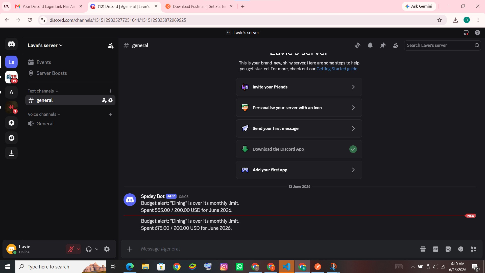

# Expense Tracker API

A Django REST Framework backend for tracking personal expenses with categories, date filtering, currency conversion, and budget alerts.

## Setup

```bash
uv sync
cp .env.example .env  # fill in SECRET_KEY
python manage.py migrate
python manage.py runserver
```

## Endpoints

| Method | Endpoint | Description |
|--------|----------|-------------|
| POST | /api/auth/register/ | Register a new user |
| POST | /api/auth/login/ | Login and get token |
| GET | /api/categories/ | List user's categories |
| POST | /api/categories/ | Create a category |
| GET | /api/expenses/ | List expenses (supports ?start_date=, ?end_date=, ?search=, ?category=, ?currency=) |
| POST | /api/expenses/ | Create an expense |
| GET | /api/expenses/{id}/ | Retrieve an expense |
| PUT | /api/expenses/{id}/ | Update an expense |
| DELETE | /api/expenses/{id}/ | Delete an expense |
| GET | /api/expenses/summary/ | Total spent per category in base currency |
| GET | /api/expenses/export/csv/ | Export expenses as CSV |

---

## My Features

### Authentication

**Overview:** Token-based authentication using Django REST Framework's built-in TokenAuthentication. Every endpoint except register and login requires a valid token.

**Design decisions:** Used DRF TokenAuthentication as it is simple, stateless, and fits a REST API well. Each user owns their own categories and expenses — all queries are filtered by `request.user` so users never see each other's data.

**API changes:** Added `user` ForeignKey to both Category and Expense models. Added `/api/auth/register/` and `/api/auth/login/` endpoints.

**Example request:**
```json
POST /api/auth/register/
{
    "username": "testuser",
    "password": "yourpassword"
}
```

**Example response:**
```json
{
    "token": "<your-token>"
}
```

Use the token in all subsequent requests:
```
Authorization: Token <your-token>
```

**Assumptions:** Username and password are required. Duplicate usernames are rejected.

**Known limits:** No token expiry — tokens are valid until manually deleted.

---

### Currency Conversion

**Overview:** Expenses can be recorded in any ISO 4217 currency (e.g. USD, EUR, NPR). The summary endpoint converts all amounts to a configured base currency using live exchange rates from open.er-api.com (no API key required).

**Design decisions:** Conversion only happens at the summary level — stored amounts are always in the original currency. If the exchange rate API fails, the amount is used as-is without conversion.

**API changes:** Added `currency` field (max 3 chars, defaults to USD) to Expense model and serializer. Updated summary response to include `base_currency`, `rate`, and `as_of`.

**Example request:**
```json
POST /api/expenses/
{
    "title": "Hotel in Paris",
    "amount": "120.00",
    "currency": "EUR",
    "category": 1,
    "date": "2026-06-13"
}
```

**Example summary response:**
```json
GET /api/expenses/summary/

{
    "base_currency": "USD",
    "categories": [
        {
            "category": "Travel",
            "total": "129.60",
            "rate": "1.08",
            "as_of": "2026-06-13"
        }
    ]
}
```

**Assumptions:** BASE_CURRENCY is configured in .env (defaults to USD). Exchange rates are fetched live on each summary request.

**Known limits:** Rates are not cached — a live API call is made per currency. If open.er-api.com is down, amounts are used without conversion.

---

### Budget Threshold Bot Alerts

**Overview:** Each category can have an optional monthly budget limit. When a created or updated expense pushes the category's month-to-date total over its limit, an alert is sent to a Discord channel via webhook.

**Design decisions:** Used Discord webhook as it requires no app installation. Alert fires on both POST (create) and PUT (update) to cover all cases where spending can increase. The webhook call is wrapped in try/except so a failure never breaks the API response.

**API changes:** Added `monthly_limit` field to Category model. Budget check added to both `expense_list` POST and `expense_detail` PUT views.

**Example:**
```json
POST /api/categories/
{
    "name": "Dining",
    "monthly_limit": "200.00"
}
```

When an expense pushes the monthly total over 200.00, the Discord channel receives:

```
Budget alert: "Dining" is over its monthly limit.
Spent 215.00 / 200.00 USD for June 2026.
```

**Discord alert screenshot:**



**Assumptions:** BOT_TOKEN in .env is a Discord webhook URL. BASE_CURRENCY is used as the currency label in the alert message.

**Known limits:** Alert fires on every expense that exceeds the limit, not just the first time. No cooldown between repeated alerts.

---

### CSV Export (Optional)

**Overview:** Users can export all their expenses as a downloadable CSV file ordered by date.

**Design decisions:** Used Django's HttpResponse with `text/csv` content type. Only the logged-in user's expenses are exported.

**Example:**
```
GET /api/expenses/export/csv/
Authorization: Token <your-token>
```

Response downloads `expenses.csv`:
```
ID,Title,Amount,Currency,Category,Date,Notes
1,Dinner out,45.00,USD,Dining,2026-06-13,
2,Hotel in Paris,120.00,EUR,Travel,2026-06-13,
```

**Known limits:** Exports all expenses with no date range filter option.

---

### Expense Search and Filtering (Optional)

**Overview:** The expense list endpoint supports filtering by title keyword, category ID, and currency in addition to the existing date range filters. All filters are optional and can be combined.

**Design decisions:** Title search uses Django's `icontains` lookup for case-insensitive matching. Currency filter is automatically uppercased.

**Examples:**
```
GET /api/expenses/?search=dinner
GET /api/expenses/?currency=EUR
GET /api/expenses/?category=1
GET /api/expenses/?start_date=2026-06-01&end_date=2026-06-30&search=hotel
```

**Known limits:** Search only applies to the title field, not notes or category name.

---

## Bugs Found and Fixed

### Bug 1 — Missing Migrations

**Description:** The expenses app had models defined but no migration files, causing `sqlite3.OperationalError: no such table: expenses_category` on first run.

**Root cause:** The initial migration file was never created and committed to the repository.

**Fix:** Ran `python manage.py makemigrations expenses` to generate the missing migration.

**Commit:** `ecf67cd`

---

### Bug 2 — Serializer Variable Typo

**Description:** Creating an expense failed with a `NameError` because `serialzer.data` was used instead of `serializer.data` in the return statement.

**Root cause:** Typo in the variable name on the final return line of `expense_list` POST.

**Fix:** Changed `serialzer.data` to `serializer.data`.

**Commit:** `f6bd3ab`

---

### Bug 3 — Inclusive Start Date Filter

**Description:** Filtering expenses by `?start_date=` excluded expenses on the start date itself because `date__gt` was used instead of `date__gte`.

**Root cause:** Wrong Django ORM lookup. The README specifies date filtering should be inclusive on both ends.

**Fix:** Changed `date__gt` to `date__gte`.

**Commit:** `4834df0`

---

### Bug 4 — Missing Sum Import

**Description:** The summary endpoint crashed with `NameError: name 'Sum' is not defined` because `Sum` was used but never imported.

**Root cause:** Missing `from django.db.models import Sum` import at the top of views.py.

**Fix:** Added the missing import.

**Commit:** `ffdfc0f`

---

### Bug 5 — Category Field Typo in Serializer

**Description:** `ExpenseSerializer` had `catgory` instead of `category` in the fields list, causing serialization and deserialization of expenses to fail.

**Root cause:** Typo in the fields list — `catgory` does not match the actual model field name `category`.

**Fix:** Changed `catgory` to `category` in `ExpenseSerializer`.

**Commit:** `64c910b`

---

### Bug 6 — URL Ordering Conflict (Bonus)

**Description:** The `expenses/summary/` route was defined after `expenses/<pk>/`, so Django matched the string "summary" as a pk value and the summary endpoint was never reachable.

**Root cause:** Django URL patterns match in order — specific routes must come before dynamic ones.

**Fix:** Moved `expenses/summary/` above `expenses/<pk>/` in urls.py.

**Commit:** `bf21a5d`